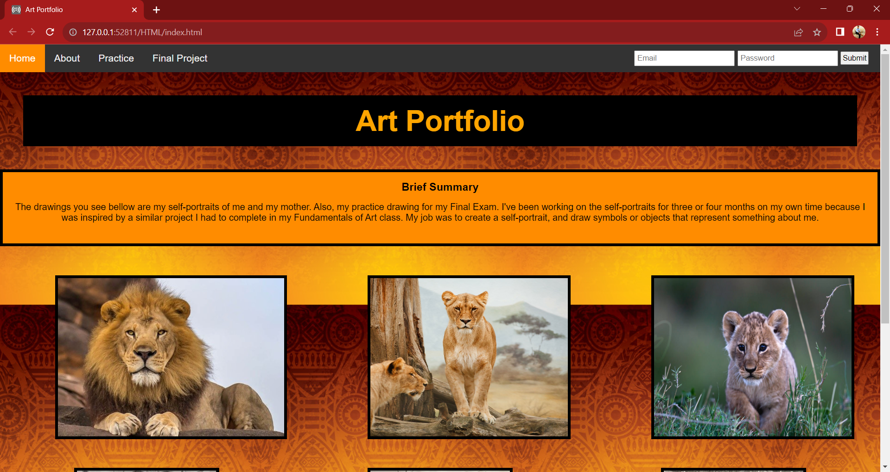
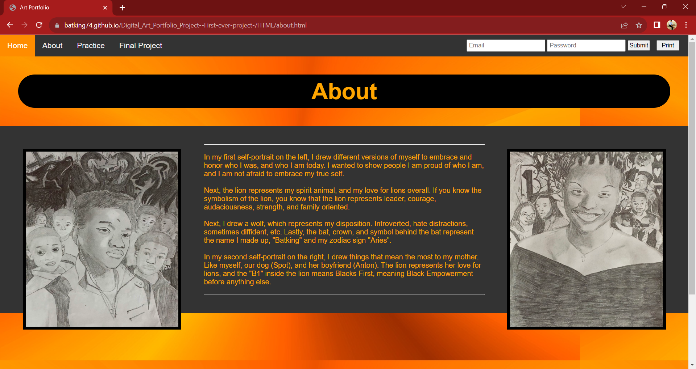

# Digital Art Portfolio Project (First ever project)

### Description
This Project is a real art portfolio final project that I had to complete in 10th grade for an art class.
My teacher wanted everyone to create a power point displaying our art projects that we worked on that year (2021).
Instead of using a power point I asked her if I could code my art portfolio so I could build something
using the teachnologies I was teaching myself at the time (HTML/CSS).

## Teachnologies used:
- HTML
- CSS

Deployed Site: https://batking74.github.io/Digital_Art_Portfolio_Project--First-ever-project-/

GitHub Repo: https://github.com/Batking74/Digital_Art_Portfolio_Project--First-ever-project-
